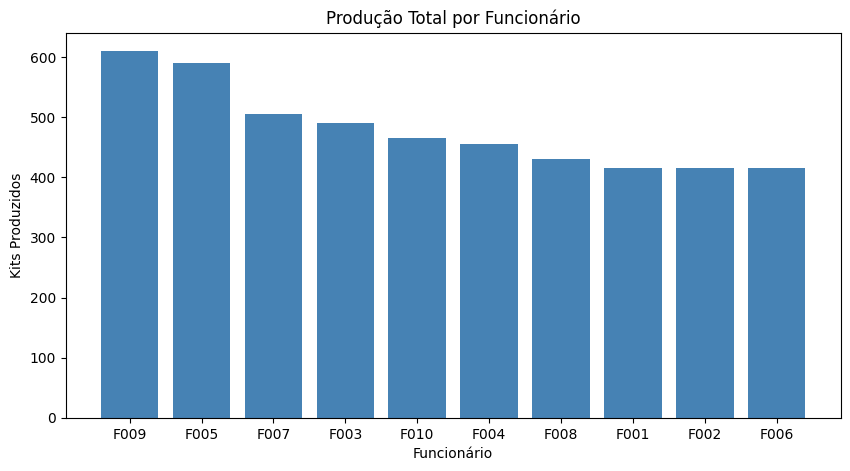
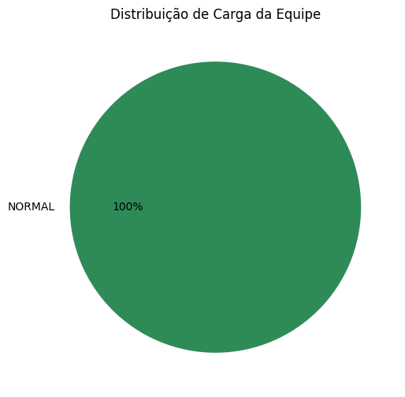

# SmartFlow — Painel Operacional de Gestão de Equipe
🔗 **[Acesse o dashboard interativo](https://smartflow-sweetata.streamlit.app)**

Ferramenta prática para gestão de equipes que acompanha metas diárias, distribui tarefas de forma equilibrada e sinaliza sobrecarga antes que ela aconteça.

## O problema

Produtividade alta não deveria significar exaustão da equipe. A proposta aqui é simples: **trabalhar com inteligência**, não trabalhar mais — usando dados reais pra equilibrar carga de trabalho antes que o cansaço vire queda de qualidade.

## Base do projeto

Dados reais coletados com a equipe da INOV (Nerópolis, GO):
- Meta individual: mínimo de 4 kits/min (sustentável, sem pressão)
- Capacidade máxima saudável: até 8-9 kits/min
- Principal causa de sobrecarga identificada: carga horária extensa

## O que o projeto faz

- Calcula ritmo médio de produção por funcionário e por equipe
- Compara desempenho real com a meta individual
- Classifica funcionários em NORMAL / ATENÇÃO / ALTO nível de carga
- Sinaliza alertas antes que a sobrecarga aconteça

 ## Visualizações

## Tecnologias

- Excel (protótipo inicial com fórmulas e dashboard)
- Python (Pandas) — migração da lógica de análise

## Status

🚧 Em desenvolvimento — próximos passos: visualização de dados e dashboard interativo.
